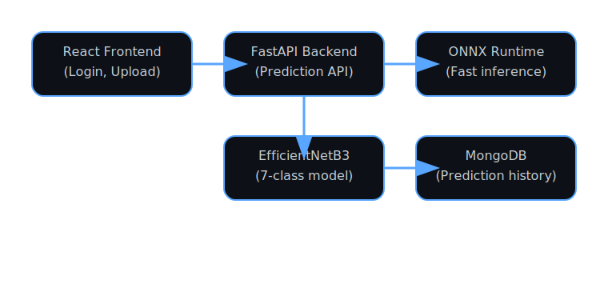
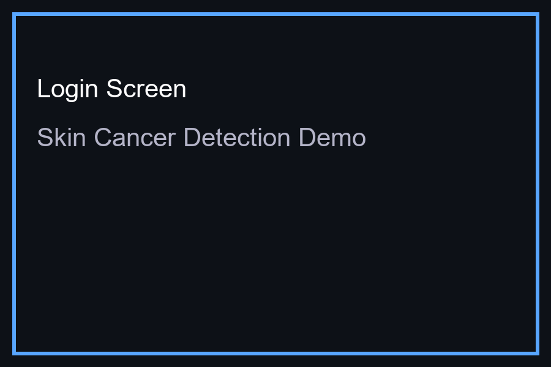

# Skin Cancer Detection

AI-powered skin cancer detection web app with FastAPI backend, React frontend, MongoDB history storage, JWT auth, Grad-CAM explainability, ONNX model support, PDF report generation, and Docker deployment.

## Structure

- `backend/` — FastAPI application, model server, auth, prediction endpoints
- `frontend/` — React UI for upload, results, history, and explanations
- `notebooks/` — model training, EDA, and Grad-CAM exploration
- `model/` — saved model artifacts, ONNX export, label map
- `tests/` — shared test utilities and integration checks
- `docker/` — deployment assets and compose helpers
- `.github/workflows/` — CI pipeline definitions

## Quick start

1. Install dependencies:
   - Backend: `pip install -r backend/requirements.txt`
   - Frontend: `cd frontend && npm install`
2. Start services with Docker Compose:
   - `docker-compose up --build`
3. Open the frontend at `http://localhost:5173`
4. Use the API at `http://localhost:8000`
## Environment & Security

- Copy `.env.example` to `.env` and fill in secret values locally.
- Never commit `.env` or any secret credentials to GitHub.
- Keep `MONGO_URI`, `SECRET_KEY`, and other API secrets out of source control.
## Architecture

React Frontend → FastAPI Backend → ONNX Runtime → EfficientNetB3 Model → MongoDB

## Key features

- EfficientNetB3 transfer learning (training notebook)
- 7-class HAM10000 classification
- Grad-CAM explainability
- JWT authentication and protected routes
- MongoDB-backed prediction history
- PDF report generation in frontend
- Dockerized backend, frontend, and database
- CI pipeline for tests and build verification

## Evaluation Metrics

This project is designed to record and display real model metrics after training on GPU.

- Accuracy: `TBD after Colab training`
- Precision: `TBD after Colab training`
- Recall: `TBD after Colab training`
- F1-score: `TBD after Colab training`
- ROC-AUC: `TBD after Colab training`
- Confusion Matrix: `TBD after Colab training`
- Melanoma Recall: `TBD after Colab training`

Metrics should be updated once the model is trained using the notebook in `notebooks/`.

## Demo Assets

Screenshots and the demo GIF are stored in:

- `frontend/public/assets/screenshots/login.png`
- `frontend/public/assets/screenshots/upload.png`
- `frontend/public/assets/screenshots/results.png`
- `frontend/public/assets/screenshots/history.png`
- `frontend/public/assets/screenshots/gradcam.png`
- `frontend/public/assets/screenshots/pdf.png`
- `docs/assets/demo.gif`

